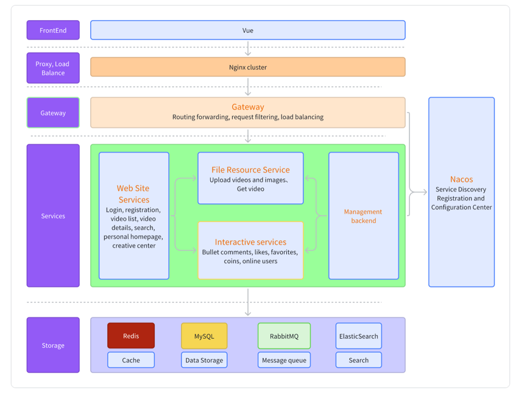

# Imitation of Bilibili project backend microservice version

## Introduction

This project is an online video sharing system where users can independently post videos, which are then reviewed by the backend. Users can interact online, comment, like, coin, and even send online bullet comments

## Architecture Diagram

## Technology

### Framework
- Spring Cloud 2021.0.6
- Spring Cloud Alibaba 2021.0.5.0
- Spring Boot 2.7.2
- MyBatis 2.2.2
- MyBatis Plus 3.5.2
- RabbitMQ 2.6.13
- ElasticSearch 3.3.2 
- OpenFeign 2.2.2.RELEASE
- Gateway 3.1.9
- Seata 2021.0.5.0
- OkHttp 4.12.0
## Tool Library
- FFmpeg 7.1
- Aspect 1.9.3
- Logback 1.2.10
- Apache Common 3.4
- Hutool 5.8.8
- Lombok 1.18.22
- Easy-Captcha 1.6.2
- Knife4j 4.4.0

## Storage
- MySQL 8
- Redis 6

## Note

The ElasticSearch installed using Docker is missing IK. So you should run `install_ik.sh` to install IK 